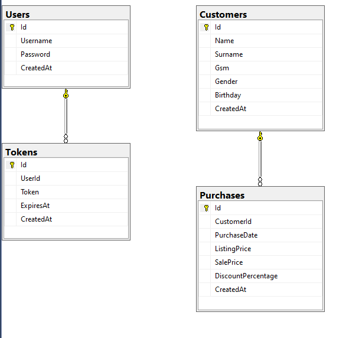

# Healthcare Async API

## Overview

This project is a FastAPI-based RESTful API that provides features like user authentication, customer management, and purchase summary reports.

## Database



## Installation

### Prerequisites

- Python 3.8+
- FastAPI
- SQLAlchemy
- pandas
- ...

You can use virtual environment during the running application:

```bash
python -m venv caseenv
caseenv\Scripts\activate
```

To install the required packages, run the following:

```bash
pip install -r requirements.txt
```

## Run the server

To run the server, navigate to the project directory and execute:

```bash
python app.py
```

### First Usage

Before the running server, for the first initialization, please set MSSql database server information in `DATABASE_URL` into `settings.py`. And, run the `create_tables.py` to set database tables with the following:

```bash
python create_tables.py
```

## Endpoints

### User Operations
- POST `/user_login/`
    - Authenticates the user.
    - Response: An access token

### Customer Operations
- POST `/create_customer/`
    - Creates a new customer.
    - Response: Customer ID

- PUT `/update_customer/{customer_id}`
    - Updates an existing customer's details.
    - Response: Customer ID

### Purchase Operations
- POST  `/create_purchase/`
    - Logs a new purchase for a customer.
    - Response: Purchase ID

- POST `/purchase_summary/`
    - Generates a summary report of purchases between given dates.
    - Response: Excel report as base64 string, total purchases, unique customers, total revenue, and total discount
